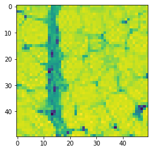

### Krishna Patel, Justin Deal, Anthony Marshall, Ben Pooser, Trevor Stanfield

# MOTIVATION OF PROJECT

Breast cancer remains the second most common cancer diagnosis across the world while also disproportionately affecting women, and many types can show relatively few signs and symptoms. It is estimated that 1 in 8 women in the United States are at risk of developing breast cancer. In 2020, it is predicted that 42,000 women in the United States alone will die from this disease [5]. The inconspicuous nature of this disease along with its prevalence are powerful testaments to its deadliness, and in an effort to lessen its threat, we have decided to concentrate on how we could best identify the disease for faster and more effective treatment.

Invasive ductal carcinoma (IDC) is the most common type of breast cancer, representing over 80% of all cases [1]. In order to identify the type of cancer and its invasiveness, pathologists scan large sections of benign regions of tissue in order to identify malignant areas; however, this process can be time consuming and difficult [2]. With this issue in mind, we have decided to focus our efforts on extracting the characteristic features of IDC from a dataset of breast histology images using various machine learning techniques. Once we extract these features, we will use binary classification to determine if IDC is present, and then compare our methods to find the model with the highest accuracy that will also generalize best to real world applications.

# DATASET AND PREPROCESSING

## **Dataset**
Our dataset is a Kaggle dataset provided by Paul Mooney. It consists of 277,524 breast histology images which originated from 162 whole mount Breast Cancer slide images [3].

Images in this dataset are of size 50x50x3. Each file name follows this format, which reveals if the image is cancerous images or not: u_xX_yY_classC.png => example 10253_idx5_x1351_y1101_class0.png.


- u : the patient ID (i.e. 10253_idx5)
- X : the x-coordinate of potential IDC (i.e. x1351)
- Y : the y-coordinate of potential IDC (i.e. y1101)
- C : the class where 0 is non-IDC and 1 is IDC [3]

### Example of the images:


## **Data Preprocessing**

We processed the data, and based on their class (0 for non-cancerous and 1 for cancerous), we were able to split our dataset. From this, we learned that these images contained 277524 total patches that we could analyze.

- `Total Image Patches:  277524`
- `Total Positive Patches:  78786`
- `Total Negative Patches:  198738`

# Methods

## **Convolutional Neural Network**

### Approach
We chose to use a Convolutional Neural Network (CNN) for detecting IDC because of its ability to identify the defining spatial properties of images and because of its pervasiveness throughout fields involving image classification such as computer vision.  Using a CNN, we were able to achieve a recall of x percent and an accuracy of y percent. We needed to preprocess our data in order to train our data on CNN before training our data.

One of the initial observations of the data was that the number of positive samples was much lower than the number of negative samples.

<!--  -->

<div>


</div>

_Graph 1. Ratio of Negative to Positive Samples_


### Improving Our Approach

The imbalanced class distributions will lead to our model generalizing poorly. This problem is exacerbated if we have unrepresentative test/train splits. In order to combat the unbalanced class problem and increase the generalizability of our model, we used stratified k-fold validation over 80% of the data. The other 20% was saved for testing. By using stratified k-fold validation, we ensured that each validation fold had an even proportion of positive and negative samples.

<!--  -->


<div>


</div>

_Graph 2. Ratio of Negative to Positive Samples Five Folds_


The model was also improved by changing the color space of the input image. The RGB colorspace is a non-uniform colorspace, and it does not separate color from luminance like HSV or LUV do. The images are normalized and converted to the LUV colorspace as a result. LUV is perceptually linear and is therefore better for detecting color differences than RGB.


<!--   -->


<div>


</div>


_Image 1. Color Space Modification: HSV_


_Image 2. Color Space Modification: LUV_


### Developing the CNN

  After the data wrangling and preprocessing, the images were fed into a CNN with seven convolution layers, three max pooling layers, a hidden dense layer, and an output layer. We also incorporated dropout layers into our model to help prevent overfitting the data.


_Graphic 1. Visualization of Graphics Layers_


The resulting learning curve shows the average loss and accuracy of the five validation folds plotted against the training data over 30 epochs. The recall chart was omitted because both the training and validation recall followed a strong logarithmic curve.


<div>


</div>


_Plot 1. Accuracy Curve Across Five Validation Folds_


_Plot 2. Loss Curve Across Five Validation Folds_


From these charts, we can see that both the validation loss and validation accuracy peak at the 16th epoch. The model is then trained on the full 80% training split over 16 epochs.

# Supervised Learning Models
###### Linear Regression, k-Nearest Neighbors, Support Vector Machine, and Neural Network

In addition to the convolutional neural net, we ran other supervised learning models: Logistic Regression (LR), K-Nearest Neighbors (KNN), Support Vector Machine (SVM), Random Forest (RF), and Decision Tree Classifier (DTC). We utilized sklearn’s Kfold and split the dataset into ten training tests. Then we used sklearn’s LogisticRegression, RandomForestClassifier, KNeighborsClassifier, Support Vector Machine SVC, DecisionTreeClassifier and compared their mean accuracies. We ran these methods twice: first on the data set without preprocessing and then once again on a data set that we had preprocessed with PCA.

## Data Preprocessing
With such a large data set size, we wanted to observe what would happen to our results and processing time if we ran PCA on the data. By using PCA, we would be able to reduce the number of features in our dataset while maintaining as much information as possible. We used a 95% variance. This data can be visualized in the scree plot below.


<div>


</div>


_Plot 1. Post-PCA Scree Plot_


## Results

In the dataset without PCA, on average, KNN, RF, and SVM had relatively similar average accuracies across the 10 folds. However, SVM had the highest average accuracy with the best accuracy being above 85%.

In the dataset with PCA, SVM also had the highest average accuracy, with KNN as the second best by approximately 4%. However, SVM took longer than any other method to complete.

The results for our supervised learning models both with and without PCA follow.

### `No PCA`
- `RF: 0.831286 (0.011019)`
- `KNN: 0.802857 (0.011429)`
- `SVM: 0.838286 (0.014802)`
- `DTC: 0.752429 (0.013141)`
- `LR: 0.688857 (0.013788)`


<div>


</div>

 _Plot 2. Comparison of 5 Methods without PCA_


### `PCA with 95% Variance`
- `RF: 0.779857 (0.013408)`
- `KNN: 0.802286 (0.014529)`
- `SVM: 0.839571 (0.014358)`
- `DTC: 0.743429 (0.019527)`
- `LR: 0.687286 (0.016592)`


<div>


</div>

 _Plot 3. Comparison of 5 Methods with PCA_


## Discussion
Initially, we expected methods which ran on the dataset with PCA to have a higher accuracy level because such a dataset would necessarily include less noise. However, as shown in our results, the methods which we ran on the dataset without PCA had better accuracies in general. One reason for this occurence may be that PCA does not take into consideration the prediction target. This would decrease accuracy because while PCA is reducing noise in the data set, it may also remove regions critical to determining the prediction target.


# Conclusion


# Contributions
- Krishna Patel - Supervised Learning Methods, Github pages setup
- Justin Deal - Convolutional Neural Network
- Anthony Marshall - Convolutional Neural Network
- Ben Pooser - Supervised Learning Methods
- Trevor Stanfield - Github pages maintenance

# References
[1] Brown, Ken. “Invasive Ductal Carcinoma (IDC) Breast Cancer: Johns Hopkins Breast Center.” Johns Hopkins Medicine, 3 Nov. 2017, www.hopkinsmedicine.org/breast_center/breast_cancers_other_conditions/invasive_ductal_carcinoma.html.

[2] Cruz-Roa, Angel, et al. “Automatic Detection of Invasive Ductal Carcinoma in Whole Slide Images with Convolutional Neural Networks.” Medical Imaging 2014: Digital Pathology, 2014, doi:10.1117/12.2043872.

[3] Mooney, Paul. :Breast Histopathology Images.” Kaggle, 2018. https://www.kaggle.com/paultimothymooney/breast-histopathology-images

[4] “U.S. Breast Cancer Statistics.” Breastcancer.org, 27 Jan. 2020, www.breastcancer.org/symptoms/understand_bc/statistics.

[5] “Use Case 6: Invasive Ductal Carcinoma (IDC) Segmentation.” Andrew Janowczyk, 5 Jan. 2018, www.andrewjanowczyk.com/use-case-6-invasive-ductal-carcinoma-idc-segmentation/.


<!-- ## Welcome to GitHub Pages

You can use the [editor on GitHub](https://github.com/patelkb99/4641-team31.github.io/edit/master/README.md) to maintain and preview the content for your website in Markdown files.

Whenever you commit to this repository, GitHub Pages will run [Jekyll](https://jekyllrb.com/) to rebuild the pages in your site, from the content in your Markdown files.

### Markdown

Markdown is a lightweight and easy-to-use syntax for styling your writing. It includes conventions for

```markdown
Syntax highlighted code block

# Header 1
## Header 2
### Header 3

- Bulleted
- List

1. Numbered
2. List

**Bold** and _Italic_ and `Code` text

[Link](url) and 
```

For more details see [GitHub Flavored Markdown](https://guides.github.com/features/mastering-markdown/).

### Jekyll Themes

Your Pages site will use the layout and styles from the Jekyll theme you have selected in your [repository settings](https://github.com/patelkb99/4641-team31.github.io/settings). The name of this theme is saved in the Jekyll `_config.yml` configuration file.

### Support or Contact

Having trouble with Pages? Check out our [documentation](https://help.github.com/categories/github-pages-basics/) or [contact support](https://github.com/contact) and we’ll help you sort it out. -->
