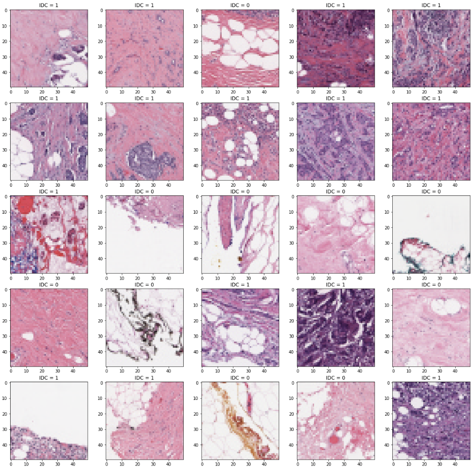
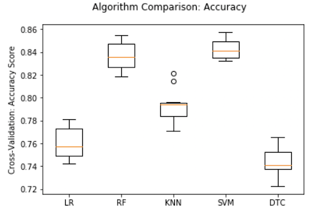
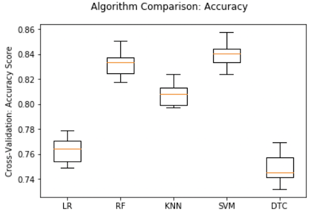
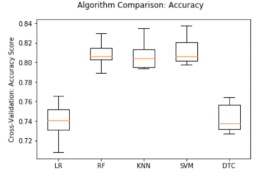
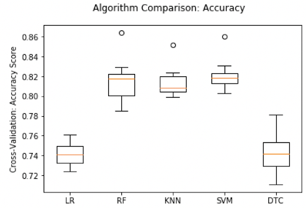

### Krishna Patel, Justin Deal, Anthony Marshall, Ben Pooser, Trevor Stanfield

# MOTIVATION OF PROJECT

Many different types of breast cancer show relatively few signs and symptoms, and the inconspicuous nature of this disease only exacerbates the danger. 1 in 8 women in the United States will develop breast cancer in her life. In 2020, it is predicted that about 42,000 women in the United States are expected to die from breast cancer [5].

Invasive ductal carcinoma (IDC) is the most common form of breast cancer, representing over 80% of all cases [1]. In order to identify the type of cancer and its invasiveness, pathologists scan large sections of benign regions in order to identify malignant areas; this process can be time consuming and difficult [2]. Therefore, for our project, we will extract features from a dataset of breast histology images. After performing feature extraction we will use binary classification to determine the presence of IDC [4].

# DATASET AND PREPROCESSING

## **Dataset**
Our dataset is a Kaggle dataset provided by Paul Mooney. It consists of 277,524 breast histology images which originated from 162 whole mount Breast Cancer slide images [3].

Images in this dataset are of size 50x50x3. Each file name follows this format, which reveals if the image is cancerous images or not: u_xX_yY_classC.png => example 10253_idx5_x1351_y1101_class0.png.


- u : the patient ID (i.e. 10253_idx5)
- X : the x-coordinate of potential IDC (i.e. x1351)
- Y : the y-coordinate of potential IDC (i.e. y1101)
- C : the class where 0 is non-IDC and 1 is IDC [3]

### Example of the images:



## **Data Preprocessing**

We processed the data, and based on their class (0 for non-cancerous and 1 for cancerous), we were able to split our dataset. From this, we learned that these images contained 277524 total patches that we could analyze.

- `Total Image Patches:  277524`
- `Total Positive Patches:  78786`
- `Total Negative Patches:  198738`

# Methods

## **Convolutional Neural Network**

### Approach
A convolutional neural network (CNN) is one of the most commonly used algorithms for image classification tasks. Using a CNN, we were able to achieve a recall of x percent and an accuracy of y percent. Before training our CNN on our data, there were several preprocessing steps that needed to occur.

One of the initial observations of the data was that the number of positive samples was significantly lower than the number of negative samples.

<!--  -->

<div>


</div>

_Graph 1. Ratio of Negative to Positive Samples_


### How we improved our approach

The imbalanced class distributions will lead to our model generalizing poorly. This problem is exacerbated if we have unrepresentative test/train splits. In order to combat both the unbalanced class problem and increase the generalizability of our model, stratified k fold validation was used over 80% of the data. The other 20% is saved for testing. By using stratified k-fold validation, we ensure that each validation fold has an even proportion of positive and negative samples.

<!--  -->


<div>


</div>

_Graph 2. Ratio of Negative to Positive Samples Five Folds_


The model was also improved by changing the color space of the input image. The RGB colorspace is a non-uniform colorspace, and it does not separate color from luminanceance like HSV or LUV do. The images are normalized and converted to the LUV colorspace as a result. LUV is perceptually linear and is therefore better for detecting color differences than RGB.


<!--   -->


<div>


</div>


_Image 1. Color Space Modification: HSV_


_Image 2. Color Space Modification: LUV_


  After the data wrangling and preprocessing, the images were fed into a CNN with 7 convolution layers, 3 max pooling layers, a hidden dense layer, and an output layer. We also incorporated dropout layers into our model to help prevent overfitting the data.


_Graphic 1. Visualization of Graphics Layers_


-- Potential Visualization of network architecture. --


The resulting learning curve shows the average loss and accuracy of the 5 validation folds plotted against the training data over 30 epochs. The recall chart was omitted because both the training and validation recall followed a strong logarithmic curve.

-- insert aforementioned curves --


From these charts, we can see that the validation loss is at a minimum at the x epoch and that the validation accuracy peaks at the y epoch. Because of this, the final model was trained over z epochs.

-- confusion matrix


--blurb describing next --


--blurb


--heat map


--Results--


# Supervised Learning Models
###### Linear Regression, k-Nearest Neighbors, Support Vector Machine, and Neural Network

In addition to the convolutional neural net, we ran other supervised learning models such as linear regression, k-nearest neighbors, support vector machine, and neural network. We utilized sklearn’s Kfold and split the dataset into 10 training tests. Then we used sklearn’s LogisticRegression, RandomForestClassifier, KNeighborsClassifier, Support Vector Machine SVC, DecisionTreeClassifier and compared their mean accuracies. We ran these methods twice, first on the data set and then again on a data set that we had preprocessed with PCA.

## Data Preprocessing
With such a large data set size, we were unable to run the dataset as is without our programs crashing. Therefore, we ran PCA on the data in order to reduce the number of variables in our dataset while maintaining as much information as possible. This data is depicted in _Plot 1. Post-PCA Scree Plot_


<div>


</div>

_Plot 1. Post-PCA Scree Plot_


<!-- We were able to experiment with the results that we could obtain. In addition to the convolutional neural net, we ran other supervised learning models such as linear regression, k-nearest neighbors, support vector machine, and neural network. We utilized sklearn’s Kfold and split the dataset into 10 training tests. Then we used sklearn’s LogisticRegression, RandomForestClassifier, KNeighborsClassifier, Support Vector Machine SVC, DecisionTreeClassifier and compared their mean accuracies. -->
## Results
Across all 5 of these procedures, Support Vector Machine consistently had the highest accuracy values. However, SVM also took the longest to run compared to the other models. We plotted their results in box plots. The following represent their mean accuracies and corresponding standard deviations in parenthesis.
<!--  -->
### `50% Variance`
- `LR: 0.760267 (0.013673)`
- `RF: 0.836800 (0.011673)`
- `KNN: 0.793333 (0.014883)`
- `SVM: 0.842533 (0.008315)`
- `DTC: 0.742400 (0.012744)`


<div>


</div>

 _Plot 2. Comparison of Algorithms at 50% Variance_


### `65% Variance`
- `LR: 0.763333 (0.009693)`
- `RF: 0.832933 (0.011172)`
- `KNN: 0.807467 (0.008686)`
- `SVM: 0.839600 (0.008925)`
- `DTC: 0.748800 (0.012368)`


<div>


</div>

 _Plot 3. Comparison of Algorithms at 65% Variance_


### `80% Variance`
- `LR: 0.739867 (0.016912)`
-` RF: 0.809200 (0.011492)`
- `KNN: 0.806133 (0.013012)`
- `SVM: 0.811067 (0.012394)`
- `DTC: 0.742667 (0.014010)`


<div>


</div>

 _Plot 4. Comparison of Algorithms at 80% Variance_


### `95% Variance`
- `LR: 0.740933 (0.011140)`
- `RF: 0.815467 (0.021302)`
- `KNN: 0.814267 (0.014884)`
- `SVM: 0.821333 (0.014919)`
- `DTC: 0.743467 (0.019670)`


<div>


</div>

 _Plot 5. Comparison of Algorithms at 95% Variance_


# Conclusion


# Contributions
- Krishna Patel - Supervised Learning Methods, Github pages setup
- Justin Deal - Convolutional Neural Network
- Anthony Marshall - Convolutional Neural Network
- Ben Pooser - Supervised Learning Methods
- Trevor Stanfield - Github pages maintenance


# References
[1] Brown, Ken. “Invasive Ductal Carcinoma (IDC) Breast Cancer: Johns Hopkins Breast Center.” Johns Hopkins Medicine, 3 Nov. 2017, www.hopkinsmedicine.org/breast_center/breast_cancers_other_conditions/invasive_ductal_carcinoma.html.

[2] Cruz-Roa, Angel, et al. “Automatic Detection of Invasive Ductal Carcinoma in Whole Slide Images with Convolutional Neural Networks.” Medical Imaging 2014: Digital Pathology, 2014, doi:10.1117/12.2043872.

[3] Janowczyk, Andrew, and Anant Madabhushi. “Deep learning for digital pathology image analysis: A comprehensive tutorial with selected use cases.” Journal of pathology informatics vol. 7 29. 2016, http://doi.org/10.4103/2153-3539.186902.

[4] Janowczyk , Andrew. “Breast Histology Images.” Kaggle, 2017, www.kaggle.com/simjeg/lymphoma-subtype-classification-fl-vs-cll.

[5] “U.S. Breast Cancer Statistics.” Breastcancer.org, 27 Jan. 2020, www.breastcancer.org/symptoms/understand_bc/statistics.

[6] “Use Case 6: Invasive Ductal Carcinoma (IDC) Segmentation.” Andrew Janowczyk, 5 Jan. 2018, www.andrewjanowczyk.com/use-case-6-invasive-ductal-carcinoma-idc-segmentation/.


<!-- ## Welcome to GitHub Pages

You can use the [editor on GitHub](https://github.com/patelkb99/4641-team31.github.io/edit/master/README.md) to maintain and preview the content for your website in Markdown files.

Whenever you commit to this repository, GitHub Pages will run [Jekyll](https://jekyllrb.com/) to rebuild the pages in your site, from the content in your Markdown files.

### Markdown

Markdown is a lightweight and easy-to-use syntax for styling your writing. It includes conventions for

```markdown
Syntax highlighted code block

# Header 1
## Header 2
### Header 3

- Bulleted
- List

1. Numbered
2. List

**Bold** and _Italic_ and `Code` text

[Link](url) and 
```

For more details see [GitHub Flavored Markdown](https://guides.github.com/features/mastering-markdown/).

### Jekyll Themes

Your Pages site will use the layout and styles from the Jekyll theme you have selected in your [repository settings](https://github.com/patelkb99/4641-team31.github.io/settings). The name of this theme is saved in the Jekyll `_config.yml` configuration file.

### Support or Contact

Having trouble with Pages? Check out our [documentation](https://help.github.com/categories/github-pages-basics/) or [contact support](https://github.com/contact) and we’ll help you sort it out. -->
