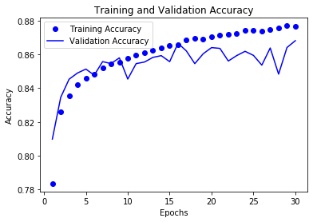

### Krishna Patel, Justin Deal, Anthony Marshall, Ben Pooser, Trevor Stanfield

# MOTIVATION OF PROJECT

Breast cancer remains the second most common cancer diagnosis across the world while also disproportionately affecting women, and many types can show relatively few signs and symptoms. It is estimated that 1 in 8 women in the United States are at risk of developing breast cancer. In 2020, it is predicted that 42,000 women in the United States alone will die from this disease [5]. The inconspicuous nature of this disease along with its prevalence are powerful testaments to its deadliness, and in an effort to lessen its threat, we have decided to concentrate on how we could best identify the disease for faster and more effective treatment.

Invasive ductal carcinoma (IDC) is the most common type of breast cancer, representing over 80% of all cases [1]. In order to identify the type of cancer and its invasiveness, pathologists scan large sections of benign regions of tissue in order to identify malignant areas; however, this process can be time consuming and difficult [2]. With this issue in mind, we have decided to focus our efforts on extracting the characteristic features of IDC from a dataset of breast histology images using various machine learning techniques. Once we extract these features, we will use binary classification to determine if IDC is present, and then compare our methods to find the model with the highest accuracy that will also generalize best to real world applications.

# DATASET AND PREPROCESSING

## **Dataset**
Our dataset is a Kaggle dataset provided by Paul Mooney. It consists of 277,524 breast histology images which originated from 162 whole mount Breast Cancer slide images [3].

Images in this dataset are of size 50x50x3. Each file name follows this format, which reveals if the image is cancerous images or not: u_xX_yY_classC.png => example 10253_idx5_x1351_y1101_class0.png.

- u : the patient ID (i.e. 10253_idx5)
- X : the x-coordinate of potential IDC (i.e. x1351)
- Y : the y-coordinate of potential IDC (i.e. y1101)
- C : the class where 0 is non-IDC and 1 is IDC [3]

### Example of the images:

  
   
  <em>Image 1. Example of Images in Dataset</em>

## **Data Preprocessing**

We processed and split our dataset based on their class (0 for no IDC present and 1 IDC present). The following are the ratios of negative to positive:

- `Total Image Patches:  277524`
- `Total Positive Patches:  78786`
- `Total Negative Patches:  198738`

  
   
  <em>Graph 1. Ratio of Negative to Positive Samples</em>

# Methods

## **Convolutional Neural Network**

### Approach
We chose to use a Convolutional Neural Network (CNN) for detecting IDC because of its ability to perform feature extraction and classification. In addition, CNNs are currently one of the most popular models in the field of computer vision due to their ability to classify images with notably higher accuracy than other machine learning models. Using a CNN, we were able to achieve a recall of 70.3 percent and an accuracy of 87.51 percent.

Before we could train our network, some data preprocessing tasks had to occur.

One of the initial observations of the data was that the number of positive samples was much lower than the number of negative samples, as shown in Graph 1. The imbalanced class distributions will lead to our model generalizing poorly. This problem is exacerbated if we have unrepresentative test/train splits. In order to combat the unbalanced class problem and increase the generalizability of our model, we used stratified k-fold validation over 80% of the data. The other 20% was saved for testing. By using stratified k-fold validation, we ensured that each validation fold had an even proportion of positive and negative samples.

  
   
  <em>Graph 2. Ratio of Negative to Positive Samples Five Folds</em>

The model was also improved by changing the color space of the input image. The RGB colorspace is a non-uniform colorspace, and it does not separate color from luminance like HSV or LUV do. The images are normalized and converted to the LUV colorspace as a result. LUV is perceptually linear and is therefore better for detecting color differences than RGB.

  
  
  
   
  <em>Image 2. Color Space Modification: HSV</em>
  
  <em>Image 3. Color Space Modification: LUV</em>

### The CNN Architecture
After the data wrangling and preprocessing, the images were fed into a CNN with seven convolution layers, three max pooling layers, a hidden dense layer, and an output layer. We also incorporated dropout layers into our model to help prevent overfitting the data.

  
   
  <em>Image 4. Visualization of Graphics Layers</em>

The resulting learning curve shows the average loss and accuracy of the five validation folds plotted against the training data over 30 epochs. The recall chart was omitted because both the training and validation recall followed a strong logarithmic curve.

  
  
  
   
  <em>Graph 3. Accuracy Curve Across 5 Validation Folds</em>
  
  <em>Graph 4. Loss Curve Across 5 Validation Folds</em>

From these charts, we can see that both the validation loss and validation accuracy peak at the 16th epoch. The model is then trained on the full 80% training split over 16 epochs.

### Improving The Results

There are several things that could be implemented that might result in an increase in recall or accuracy. First, we could randomly oversample the positive samples. Since the model prioritizes recall over accuracy, it is more important that a positive sample is labeled as positive than that the model predicts both classes equally. With more positive image samples in each of the validation folds, it is more likely a positive image is label correctly.

  
   
  <em>Graph 5. Confusion Matrix</em>

From the graph, we can see that our model had an easier time detecting the negative test cases with an accuracy rate of 92% and a type 1 error rate of 8%. Our model was able to detect positive test cases with only 73% accuracy and a type 2 error rate of 27%.

The CNN architecture could also improve. With more time and experimentation, we potentially could have performed more experimentation with the layers of our model. Additionally, if there were more available computational resources, more hyperparameter tuning could occur. As previously mentioned, the validation recall continually increased with the training recall. The key issue is balancing the recall precision tradeoff.

## Supervised Learning Models
### Linear Regression, k-Nearest Neighbors, Support Vector Machine, Random Forest, and Decision Tree Classifier

In addition to the convolutional neural net, we ran other supervised learning models: Logistic Regression (LR), K-Nearest Neighbors (KNN), Support Vector Machine (SVM), Random Forest (RF), and Decision Tree Classifier (DTC). We utilized sklearn’s Kfold and split the dataset into ten training tests. Then we used sklearn’s LogisticRegression, RandomForestClassifier, KNeighborsClassifier, Support Vector Machine SVC, DecisionTreeClassifier and compared their mean accuracies. We ran these methods twice: first on the dataset without preprocessing and then once again on a dataset that we had preprocessed with PCA.

### Data Preprocessing
First, we split the dataset into a training and testing set with an 80-20 split respectively. With such a large dataset size, we wanted to observe what would happen to our results and processing time if we ran PCA on the data. By running PCA on the data with a 95% variance, we would be able to reduce the number of features in our dataset while maintaining as much information as possible. Then, we normalized the data over the features. The variances can be visualized in graph 6.

  
   
  <em>Graph 6. Cumulative Explained Variance vs. Number of Components</em>

### Results

In the dataset without PCA, on average, KNN, RF, and SVM had relatively similar average accuracies across the 10 folds. However, SVM had the highest average accuracy with the best accuracy being above 85%, but this test also took the longest to process.

In the dataset with PCA, SVM also had the highest average accuracy, with KNN as the second best by approximately 4%. Once again, SVM took longer than any other method to complete.

The average accuracies and their standard deviations for our supervised learning models both with and without PCA follow:

#### `No PCA`
- `RF: 0.831286 (0.011019)`
- `KNN: 0.802857 (0.011429)`
- `SVM: 0.838286 (0.014802)`
- `DTC: 0.752429 (0.013141)`
- `LR: 0.688857 (0.013788)`

  
   
  <em>Graph 7. Comparison of Five Methods without PCA</em>

#### `PCA with 95% Variance`
- `RF: 0.779857 (0.013408)`
- `KNN: 0.802286 (0.014529)`
- `SVM: 0.839571 (0.014358)`
- `DTC: 0.743429 (0.019527)`
- `LR: 0.687286 (0.016592)`

  
   
  <em>Graph 8. Comparison of Five Methods with PCA</em>

### Discussion
Initially, we expected methods which ran on the dataset with PCA to have a higher accuracy level because such a dataset would necessarily include less noise. However, as shown in our results, the methods which we ran on the dataset without PCA had better accuracies in general. One reason for this occurence may be that PCA does not take into consideration the prediction target. This would decrease accuracy because while PCA is reducing noise in the dataset, it may also remove regions critical to determining the prediction target.

# Conclusion

With more improvements to this model, we could save critical time for pathologists and medical providers and help reduce the likelihood of incorrect diagnoses. We could then consider expanding our model to detect different stages of IDC and other forms of breast cancer. Although we tried numerous different models in our approach to detecting IDC, we were correct in our assumption that the convolutional neural net would give us the best results compared to other supervised learning methods. Since we likely fed our model a sufficient amount of data and added several dropout layers to the CNN, it would likely generalize well to real world applications. However, one downside to our approach was that data we trained our CNN on used a much larger proportion of negative test cases than positive ones, so for future work, we could implement a random oversampling of positive test cases. Another limitation we dealt with was our computers and amount of time it took to train our models after tuning the hyperparameters. Despite this, we still consider our project a major success in regards to what we have accomplished and learned throughout the semester and the accuracy we have achieved in detecting IDC.

# Contributions
- Krishna Patel - Supervised Learning Methods, Github pages setup
- Justin Deal - Convolutional Neural Network
- Anthony Marshall - Convolutional Neural Network
- Ben Pooser - Supervised Learning Methods
- Trevor Stanfield - Github pages maintenance

# References
[1] Brown, Ken. “Invasive Ductal Carcinoma (IDC) Breast Cancer: Johns Hopkins Breast Center.” Johns Hopkins Medicine, 3 Nov. 2017, www.hopkinsmedicine.org/breast_center/breast_cancers_other_conditions/invasive_ductal_carcinoma.html.

[2] Cruz-Roa, Angel, et al. “Automatic Detection of Invasive Ductal Carcinoma in Whole Slide Images with Convolutional Neural Networks.” Medical Imaging 2014: Digital Pathology, 2014, doi:10.1117/12.2043872.

[3] Mooney, Paul. :Breast Histopathology Images.” Kaggle, 2018. https://www.kaggle.com/paultimothymooney/breast-histopathology-images

[4] “U.S. Breast Cancer Statistics.” Breastcancer.org, 27 Jan. 2020, www.breastcancer.org/symptoms/understand_bc/statistics.

[5] “Use Case 6: Invasive Ductal Carcinoma (IDC) Segmentation.” Andrew Janowczyk, 5 Jan. 2018, www.andrewjanowczyk.com/use-case-6-invasive-ductal-carcinoma-idc-segmentation/.
